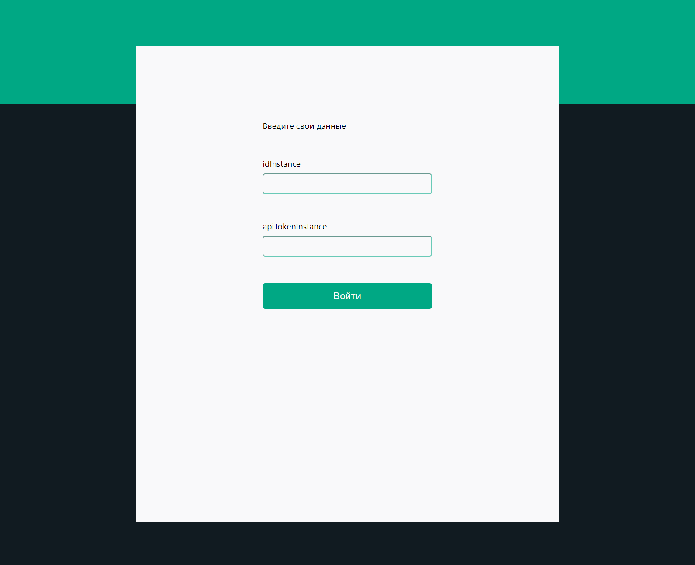
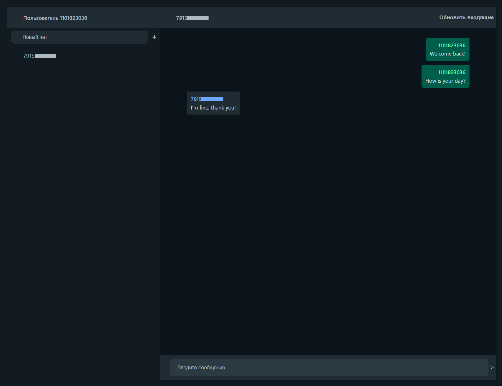

# Пользовательский интерфейс для отправки и получения сообщений WhatsApp

С использованием сервиса GREEN-API https://green-api.com/.
За прототип интерфейса взят внешний вид чата https://web.whatsapp.com/.

## Локальный запуск проекта

Необходимо поочередно ввести команды

### `git clone https://github.com/Anastacia-Tesli/WhatsApp-connect.git`

Клонировать репозиторий 

### `npm install`

Установить зависимости

### `npm start`

Запуск в режиме разработчика по адресу [http://localhost:3000](http://localhost:3000) в браузере.

### `npm run build`

Инициализирует сборку проекта в папке `build`. Подходит для продакшена.

## Внешний вид интерфейса

_Страница входа_

_Пример переписки в чате_

